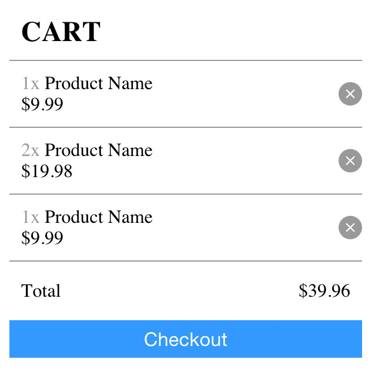

# Shopping cart
---

Create a cart component for an online store.

Details:
- Title "Cart"
- List of products
  - Product quantity "2x", "3x"
  - Product name
  - Product price
  - Remove buttom item "&times;"
- Cart total
  - Text "Total"
  - Price
- "Checkout" button

Preview:

